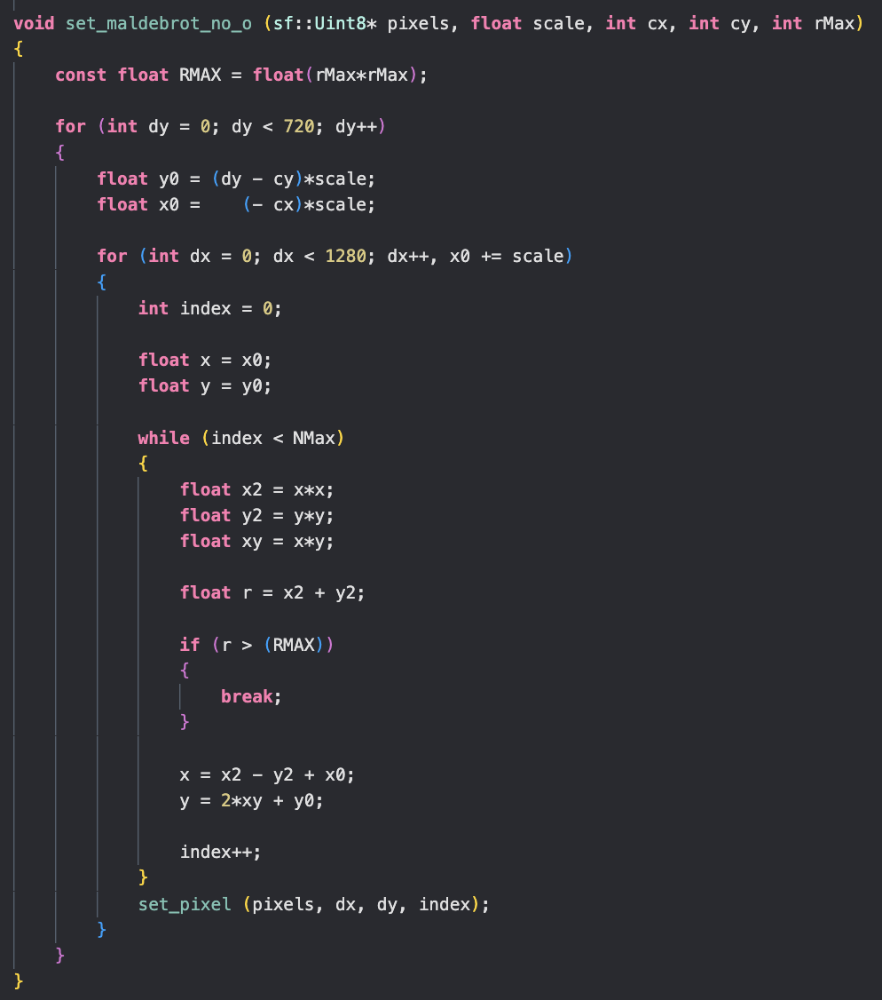

# Оптимизация фрактала Мандельброта

## О ПРОЕКТЕ
В этом проекте я занимался оптимизацией алгоритма расчета множества Мандельброта, используя доступные на моем компьютере SIMD-инструкции такие, как SSE2, AVX2, AVX512, и флаги оптимизации компилятора, такие как -O1, -O2, -O3, -Ofast.

## Алгоритм рисования

Для удобного чтения кода расмотрим алгоритм рисования без примения оптимизаций:

Функция принимает такие переменные, как:
1. **sf::Uint8* pixels** - указатель на массив пикселей изображения множества;
2. **float scale** - коэффициент приближения изображения множества;
3. **int cx, int cy** - координаты отображения центральной точки множества;
4. **int rMax** - максимальное расстояние точки от центра при расчетах;

В функции вводятся такие переменные, как:
1. **float dx, dy** - координаты текущего пикселя (того, что обрабатывается в данный момент);
2. **float x0, y0** - координаты текущего пикселя, относительно выбранного центрального пикселя;
3. **int index** - количество итераций обработки текущего пикселя

...

Как мы видим, производительность алгоритма зависит от количества пикселей в результирующем изображении. Алгоритм необходимо оптимизировать, так как в данном случае время расчетов пропорционально количеству рабочих пикселей.

Количество рабочих пикселей в алгоритме равно 1280*720 = 921600.

Этот алгоритм часто используется для оценки вычислительной скорости аппаратного обеспечения.

Примечание: SFML используется в качестве графической библиотеки.

## Принципы оптимизации

Идеи оптимизаций, использующих инструкции SSE2, AVX2, AVX512, одинаковы.

В случае использования инструкций SSE2 и переменных типа _m128 мы можем одновременно обрабатывать по 4 пикселя, или же по 8 пикселей, используя инструкции AVX2 и переменные типа _m256. Также мы можем обрабатывать и по 16 пикселей одновременно с помощью инструкций AVX512 и переменных типа _m512.

## Результаты оптимизаций

В таблице ниже приведены значения FPS, измеренные для различных режимов оптимизации:

|Оптимизаиция \ Флаг|НЕТ |-O0 |-O1 |-O2 |-O3 |-Ofast |
|:------------------|:--:|:--:|:--:|:--:|:--:|:-----:|
|БЕЗ оптимизаций    |1.2 |1.2 |1.9 |2.1 |2.1 |2.2    |
|                   |    |    |    |    |    |       |
|Массивы пикселей   |0.3 |0.2 |1.1 |7.4 |7.4 |7.7    |
|                   |    |    |    |    |    |       |
|SSE инструкции     |1.9 |1.9 |4.5 |6.0 |6.0 |6.2    |
|                   |    |    |    |    |    |       |
|AVX2 инструкции    |2.9 |2.9 |5.5 |9.0 |9.0 |9.1    |
|                   |    |    |    |    |    |       |
|AVX512 инструкции  |4.0 |4.0 |6.4 |11.8|11.9|12.1   |

## Вывод
Оптимизация алгоритма рисования множества Мандельброта с использованием инстукций AVX512 позволяет его ускорить в **12.1/2.2 = 5.5** раз
