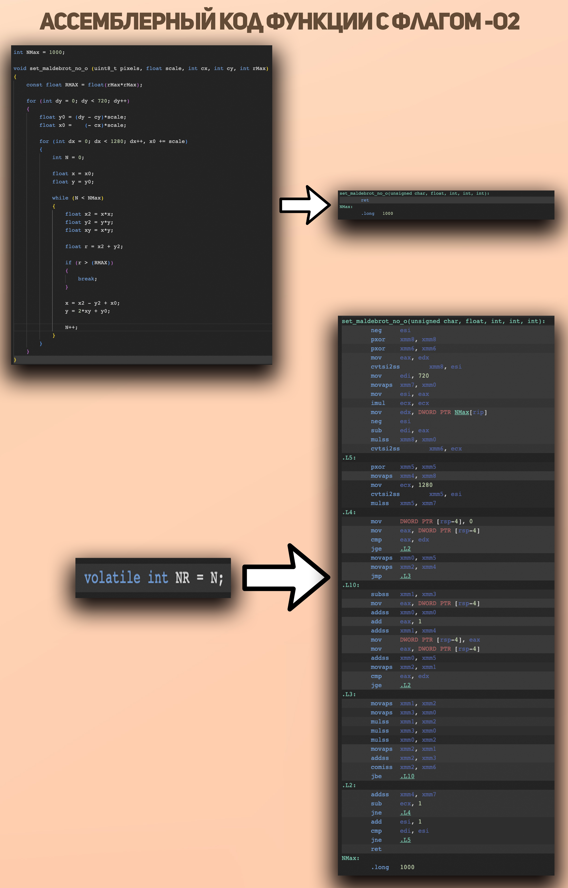

# Оптимизация фрактала Мандельброта


## О ПРОЕКТЕ
В этом проекте я занимался оптимизацией алгоритма расчета множества Мандельброта, используя доступные на моем компьютере SIMD-инструкции такие, как SSE2, AVX2, AVX512, и флаги оптимизации компилятора, такие как -O1, -O2, -O3, -Ofast.

## Множество Мандельброта

**Множество Мандельброта** - это множество точек на плоскости таких, что для рекурсивных уравнений $x_{i+1} = x_i^2 - y_i^2 + x_0$ и $y_{i+1} = 2 * x_i * y_i+ y_0$ выполняется неравенство $R = (x^2 + y^2)^{1/2} >= R_{max}$, то есть функция $f(x_0, y_0) -> N$ ставит $(x_0, y_0)$ в соответствие число N - количество операций для нахождения таких x и y, что выполняется неравенство выше. Это множество является фрактальным.

## Запуск программы

Прежде всего, скачайте этот репозиторий:
```bash
git@github.com:KirillLakhnov/Maldebrot
```
Cкомпилируйте программу с помощью **makefile**:
```bash
make no_o   \\ для версии без оптимизаций
make sse    \\ для версии с SSE
make avx2   \\ для версии с AVX2
make avx512 \\ для версии с AVX512
```
Запустите программу:
```bash
./a.out
```

Примечание: Эта программа требует, чтобы SFML был установлен в вашей системе. Вы можете скачать SFML с официального сайта: https://www.sfml-dev.org/download.php

## Алгоритм и его оптимизация 

Алгоритм расчета этого множества часто используется для оценки вычислительной скорости аппаратного обеспечения.

Размер вычисляемого множества 1280x720.

### Код неоптимизированного алгоритма
```C++
const int XMax = 1280;
const int YMax = 720;
const int Nmax = 1000;

for (int dy = 0; dy < YMax; dy++)
{
    float y0 = (dy - cy)*scale;
    float x0 = (   - cx)*scale;

    for (int dx = 0; dx < XMax; dx++, x0 += scale)
    {
        int N = 0;

        float x = x0;
        float y = y0;

        while (N < NMax)
        {
            float x2 = x*x;
            float y2 = y*y;
            float xy = x*y;

            float r = x2 + y2;

            if (r > (RMAX)) 
            {
                break;
            }

            x = x2 - y2 + x0;
            y = 2*xy + y0;

            N++;
        }
    }
}
```

Производительность неоптимизированного алгоритма пропорциональна количеству пикселей. 

## Принципы оптимизации

Теперь оптимизируем данный код, используя набор команд SIMD-инструкции. Ознакомиться с командами можно на сайте: https://www.laruence.com/sse.

SIMD-инструкции специально разработаны для параллельных операций. Это делает их особенно полезными для нашего алгоритма. Они позволяют вести расчеты сразу для 4, 8, 16 пикселей в случаях SSE, AVX2, AVX512.

### Код оптимизированного алгоритма (AVX2)
```C++
const int XMax = 1280;
const int YMax = 720;
const int Nmax = 1000;

const int VECT_SIZE_AVX2 = 8;

const __m256i NMAX = _mm256_set1_epi32 (NMax);

for (int dy = 0; dy < YMax; dy++)
{
    float y0 = (dy - cy) * scale;
    float x0 = (   - cx) * scale;

    for (int dx = 0; dx < XMax; dx += VECT_SIZE_AVX2, x0 += VECT_SIZE_AVX2 * scale)
    {
        __m256 X0 = _mm256_set_ps (x0 + 7 * scale, x0 + 6 * scale, 
                                   x0 + 5 * scale, x0 + 4 * scale, 
                                   x0 + 3 * scale, x0 + 2 * scale, 
                                   x0 + scale, x0);

        __m256 Y0 = _mm256_set1_ps (y0);

        __m256 X = X0;
        __m256 Y = Y0;

        __m256i  N = _mm256_setzero_si256 ();
        __m256 cmp = _mm256_setzero_ps ();
        __m256  X2 = _mm256_setzero_ps ();
        __m256  Y2 = _mm256_setzero_ps ();
        __m256  XY = _mm256_setzero_ps ();
        __m256   R = _mm256_setzero_ps ();

        int mask = 1;

        while (mask > 0)
        {
            mask = 0;

            X2 = _mm256_mul_ps (X, X);
            Y2 = _mm256_mul_ps (Y, Y);
            XY = _mm256_mul_ps (X, Y);
            R  = _mm256_add_ps (X2, Y2);

            X = _mm256_add_ps (_mm256_sub_ps (X2, Y2), X0);
            Y = _mm256_add_ps (_mm256_add_ps (XY, XY), Y0);

            cmp = _mm256_cmp_ps (RMAX, R, _CMP_GT_OQ);
            cmp = _mm256_and_ps (cmp, _mm256_castsi256_ps (_mm256_cmpgt_epi32 (NMAX, N)));

            N = _mm256_sub_epi32 (N, _mm256_castps_si256(cmp));
            mask = _mm256_movemask_ps (cmp);
        }
    }
}
```
## Результаты оптимизаций

В таблице ниже приведено среднее время расчетов для различных типов оптимизаций.

|Оптимизаиция \ Флаг|НЕТ    |-O1    |-O2    |-O3    |-Ofast |
|:------------------|:-----:|:-----:|:-----:|:-----:|:-----:|
|БЕЗ оптимизаций    |0.69 с |0.41 c |0.39 c |0.39 c |0.38 c |
|                   |       |       |       |       |       |
|SSE инструкции     |0.51 c |0.11 c |0.11 c |0.11 c |0.10 c |
|                   |       |       |       |       |       |
|AVX2 инструкции    |0.20 c |0.06 c |0.05 c |0.05 c |0.05 c |
|                   |       |       |       |       |       |
|AVX512 инструкции  |0.11 c |0.03 c |0.03 c |0.03 c |0.03 c |

### INLINE функции

Сделаем функции, которые возможно, ``inline`` функциями.

Ключевое слово ``inline`` указывает компилятору заменить код в определении функции для каждого экземпляра вызова функции.

Применение встраиваемых функций может ускорить выполнение программ, поскольку устраняет нагрузку на вызов функций. Компилятор может оптимизировать встроенные функции, развернутые способами, недоступными для обычных функций.

Подстановка встроенного кода выполняется по усмотрению компилятора. Например, компилятор не подставляет функцию, если ее адрес был получен или если она слишком велика для подстановки.

### Ошибка, с которой можно столкнуться

При выключенной отрисовке полученное число N нигде не используется. Поэтому оптимизация с флагами -O2, -O3, -Ofast приведет к тому, что вычисления не будут производится. Это приведет к получению некорректных данных.
Чтобы этого избежать объявим ``volatile`` переменную, которой будем присваивать результаты вычислений **N**, чтобы разрешить компилятору оптимизировать вычисления и при этом не потерять их результаты.



## Вывод
Оптимизация алгоритма рисования множества Мандельброта с использованием инстукций AVX512 и флага компиляции -Ofast позволяет его ускорить в **0.69/0.03 = 23** раза.

## Источники и литератрура 

1. SIMD:
    - https://ru.wikipedia.org/wiki/SIMD
    - https://www.laruence.com/sse

2. Множество Мандельброта:
    - https://ru.wikipedia.org/wiki/Альфа-канал

3. SFML
    - https://www.sfml-dev.org/
    - https://ru.wikipedia.org/wiki/SFML
    - https://ps-group.github.io/ps1/lesson_sfml_1
